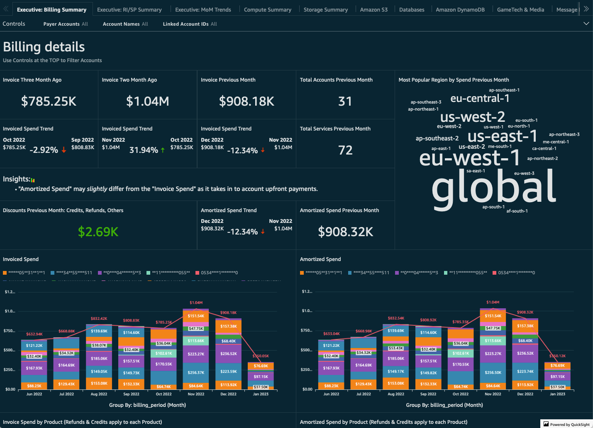
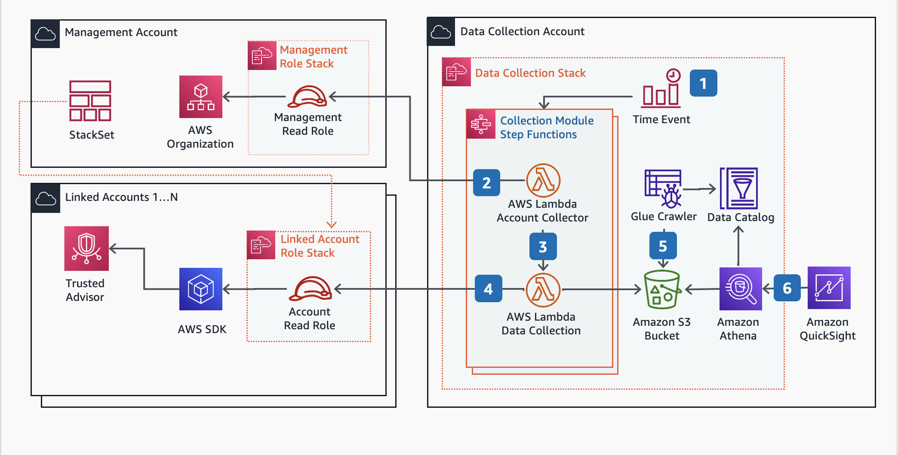

# Terraform AWS Cloud Intelligence Dashboards

<p align="center">
   
</p>

## Description

The purpose of this module is to deploy the AWS Cloud Intelligence Dashboards (CUDOS) framework. The framework is a collection of dashboards that provide insights into your AWS environment. The dashboards are built using AWS QuickSight and are designed to provide insights into your AWS environment.

## Usage

Add example usage here

```hcl
module "cudos_framework" {
  source = "../.."

  dashbords_bucket_name              = var.dashboard_bucket_name
  enable_compute_optimizer_dashboard = true
  enable_cost_intelligence_dashboard = true
  enable_cudos_dashboard             = true
  enable_cudos_v5_dashboard          = true
  enable_kpi_dashboard               = true
  enable_sso                         = true
  enable_tao_dashboard               = false
  saml_metadata                      = file("${path.module}/assets/saml-metadata.xml")
  quicksights_username               = var.quicksights_username
  tags                               = var.tags

  providers = {
    aws.management              = aws.management
    aws.management_us_east_1    = aws.management_us_east_1
    aws.cost_analysis           = aws.cost_analysis
    aws.cost_analysis_us_east_1 = aws.cost_analysis_us_east_1
  }
}
```

## Deployment Architecture

The following is taken from the Cloud Intelligence Dashboards framework, and depicts the deployment architecture:

<p align="center">
  
</p>

## References

- [Identity Center integration](https://cloudyadvice.com/2022/04/29/implementing-cudos-cost-intelligence-dashboards-for-an-enterprise/)
- [CID Framework](https://github.com/awslabs/cid-framework)
- [CUDOS Deployment](https://github.com/aws-samples/aws-cudos-framework-deployment)

## Upgrading the dashboards

Due to the level of customization that can be done with the dashboards, it is recommended to follow the official documentation to upgrade the dashboards. The following steps are a general guide to upgrade the dashboards:

1. Download the latest version of `cid-cmd`, the instructions can be found [here](https://github.com/aws-samples/aws-cudos-framework-deployment?tab=readme-ov-file#install)
2. Run the `cic-cmd` command to upgrade the dashboards, selecting each of the dashboards that you want to upgrade.
3. Pay attention the Athena views, ensuring any customizations are not overwritten.

## Update Documentation

The `terraform-docs` utility is used to generate this README. Follow the below steps to update:

1. Make changes to the `.terraform-docs.yml` file
2. Fetch the `terraform-docs` binary (https://terraform-docs.io/user-guide/installation/)
3. Run `terraform-docs markdown table --output-file ${PWD}/README.md --output-mode inject .`

<!-- BEGIN_TF_DOCS -->
## Requirements

| Name | Version |
|------|---------|
| <a name="requirement_terraform"></a> [terraform](#requirement\_terraform) | >= 1.0 |
| <a name="requirement_aws"></a> [aws](#requirement\_aws) | ~> 5.0 |

## Providers

| Name | Version |
|------|---------|
| <a name="provider_aws"></a> [aws](#provider\_aws) | ~> 5.0 |
| <a name="provider_aws.cost_analysis"></a> [aws.cost\_analysis](#provider\_aws.cost\_analysis) | ~> 5.0 |
| <a name="provider_aws.management"></a> [aws.management](#provider\_aws.management) | ~> 5.0 |

## Modules

| Name | Source | Version |
|------|--------|---------|
| <a name="module_cloudformation_bucket"></a> [cloudformation\_bucket](#module\_cloudformation\_bucket) | terraform-aws-modules/s3-bucket/aws | 4.1.2 |
| <a name="module_collector"></a> [collector](#module\_collector) | github.com/aws-samples/aws-cudos-framework-deployment//terraform-modules/cur-setup-destination | 0.3.8 |
| <a name="module_dashboard_bucket"></a> [dashboard\_bucket](#module\_dashboard\_bucket) | terraform-aws-modules/s3-bucket/aws | 4.1.2 |
| <a name="module_dashboards"></a> [dashboards](#module\_dashboards) | github.com/aws-samples/aws-cudos-framework-deployment//terraform-modules/cid-dashboards | 0.3.8 |
| <a name="module_source"></a> [source](#module\_source) | github.com/aws-samples/aws-cudos-framework-deployment//terraform-modules/cur-setup-source | 0.3.8 |

## Resources

| Name | Type |
|------|------|
| [aws_cloudformation_stack.cudos_data_collection](https://registry.terraform.io/providers/hashicorp/aws/latest/docs/resources/cloudformation_stack) | resource |
| [aws_cloudformation_stack.cudos_read_permissions](https://registry.terraform.io/providers/hashicorp/aws/latest/docs/resources/cloudformation_stack) | resource |
| [aws_iam_role.cudos_sso](https://registry.terraform.io/providers/hashicorp/aws/latest/docs/resources/iam_role) | resource |
| [aws_iam_saml_provider.saml](https://registry.terraform.io/providers/hashicorp/aws/latest/docs/resources/iam_saml_provider) | resource |
| [aws_quicksight_account_subscription.subscription](https://registry.terraform.io/providers/hashicorp/aws/latest/docs/resources/quicksight_account_subscription) | resource |
| [aws_quicksight_group.groups](https://registry.terraform.io/providers/hashicorp/aws/latest/docs/resources/quicksight_group) | resource |
| [aws_quicksight_group_membership.members](https://registry.terraform.io/providers/hashicorp/aws/latest/docs/resources/quicksight_group_membership) | resource |
| [aws_quicksight_user.users](https://registry.terraform.io/providers/hashicorp/aws/latest/docs/resources/quicksight_user) | resource |
| [aws_s3_object.cloudformation_templates](https://registry.terraform.io/providers/hashicorp/aws/latest/docs/resources/s3_object) | resource |
| [aws_caller_identity.cost_analysis](https://registry.terraform.io/providers/hashicorp/aws/latest/docs/data-sources/caller_identity) | data source |
| [aws_caller_identity.management](https://registry.terraform.io/providers/hashicorp/aws/latest/docs/data-sources/caller_identity) | data source |
| [aws_iam_policy_document.cudos_sso](https://registry.terraform.io/providers/hashicorp/aws/latest/docs/data-sources/iam_policy_document) | data source |
| [aws_iam_policy_document.cudos_sso_permissions](https://registry.terraform.io/providers/hashicorp/aws/latest/docs/data-sources/iam_policy_document) | data source |
| [aws_iam_policy_document.dashboards_bucket_policy](https://registry.terraform.io/providers/hashicorp/aws/latest/docs/data-sources/iam_policy_document) | data source |
| [aws_iam_policy_document.stack_bucket_policy](https://registry.terraform.io/providers/hashicorp/aws/latest/docs/data-sources/iam_policy_document) | data source |
| [aws_organizations_organization.current](https://registry.terraform.io/providers/hashicorp/aws/latest/docs/data-sources/organizations_organization) | data source |
| [aws_region.cost_analysis](https://registry.terraform.io/providers/hashicorp/aws/latest/docs/data-sources/region) | data source |

## Inputs

| Name | Description | Type | Default | Required |
|------|-------------|------|---------|:--------:|
| <a name="input_dashboards_bucket_name"></a> [dashboards\_bucket\_name](#input\_dashboards\_bucket\_name) | The name of the bucket to store the dashboards configurations | `string` | n/a | yes |
| <a name="input_tags"></a> [tags](#input\_tags) | Tags to apply to all resources | `map(string)` | n/a | yes |
| <a name="input_enable_backup_module"></a> [enable\_backup\_module](#input\_enable\_backup\_module) | Indicates if the Backup module should be enabled | `bool` | `true` | no |
| <a name="input_enable_budgets_module"></a> [enable\_budgets\_module](#input\_enable\_budgets\_module) | Indicates if the Budget module should be enabled | `bool` | `true` | no |
| <a name="input_enable_compute_optimizer_dashboard"></a> [enable\_compute\_optimizer\_dashboard](#input\_enable\_compute\_optimizer\_dashboard) | Indicates if the Compute Optimizer dashboard should be enabled | `bool` | `true` | no |
| <a name="input_enable_compute_optimizer_module"></a> [enable\_compute\_optimizer\_module](#input\_enable\_compute\_optimizer\_module) | Indicates if the Compute Optimizer module should be enabled | `bool` | `true` | no |
| <a name="input_enable_cost_anomaly_module"></a> [enable\_cost\_anomaly\_module](#input\_enable\_cost\_anomaly\_module) | Indicates if the Cost Anomaly module should be enabled | `bool` | `true` | no |
| <a name="input_enable_cost_intelligence_dashboard"></a> [enable\_cost\_intelligence\_dashboard](#input\_enable\_cost\_intelligence\_dashboard) | Indicates if the Cost Intelligence dashboard should be enabled | `bool` | `true` | no |
| <a name="input_enable_cost_optimization_hub_module"></a> [enable\_cost\_optimization\_hub\_module](#input\_enable\_cost\_optimization\_hub\_module) | Indicates if the Compute Optimization Hub module should be enabled | `bool` | `true` | no |
| <a name="input_enable_cudos_dashboard"></a> [enable\_cudos\_dashboard](#input\_enable\_cudos\_dashboard) | Indicates if the CUDOS dashboard should be enabled | `bool` | `false` | no |
| <a name="input_enable_cudos_v5_dashboard"></a> [enable\_cudos\_v5\_dashboard](#input\_enable\_cudos\_v5\_dashboard) | Indicates if the CUDOS V5 framework should be enabled | `bool` | `true` | no |
| <a name="input_enable_ecs_chargeback_module"></a> [enable\_ecs\_chargeback\_module](#input\_enable\_ecs\_chargeback\_module) | Indicates if the ECS Chargeback module should be enabled | `bool` | `false` | no |
| <a name="input_enable_health_events"></a> [enable\_health\_events](#input\_enable\_health\_events) | Indicates if the Health Events module should be enabled | `bool` | `true` | no |
| <a name="input_enable_inventory_module"></a> [enable\_inventory\_module](#input\_enable\_inventory\_module) | Indicates if the Inventory module should be enabled | `bool` | `true` | no |
| <a name="input_enable_kpi_dashboard"></a> [enable\_kpi\_dashboard](#input\_enable\_kpi\_dashboard) | Indicates if the KPI dashboard should be enabled | `bool` | `true` | no |
| <a name="input_enable_license_manager_module"></a> [enable\_license\_manager\_module](#input\_enable\_license\_manager\_module) | Indicates if the License Manager module should be enabled | `bool` | `false` | no |
| <a name="input_enable_org_data_module"></a> [enable\_org\_data\_module](#input\_enable\_org\_data\_module) | Indicates if the Organization Data module should be enabled | `bool` | `true` | no |
| <a name="input_enable_prerequisites_quicksight"></a> [enable\_prerequisites\_quicksight](#input\_enable\_prerequisites\_quicksight) | Indicates if the prerequisites for QuickSight should be enabled | `bool` | `true` | no |
| <a name="input_enable_prerequisites_quicksight_permissions"></a> [enable\_prerequisites\_quicksight\_permissions](#input\_enable\_prerequisites\_quicksight\_permissions) | Indicates if the prerequisites for QuickSight permissions should be enabled | `bool` | `true` | no |
| <a name="input_enable_quicksight_subscription"></a> [enable\_quicksight\_subscription](#input\_enable\_quicksight\_subscription) | Enable QuickSight subscription | `bool` | `false` | no |
| <a name="input_enable_rds_utilization_module"></a> [enable\_rds\_utilization\_module](#input\_enable\_rds\_utilization\_module) | Indicates if the RDS Utilization module should be enabled | `bool` | `true` | no |
| <a name="input_enable_rightsizing_module"></a> [enable\_rightsizing\_module](#input\_enable\_rightsizing\_module) | Indicates if the Rightsizing module should be enabled | `bool` | `true` | no |
| <a name="input_enable_sso"></a> [enable\_sso](#input\_enable\_sso) | Enable integration with identity center for QuickSight | `bool` | `true` | no |
| <a name="input_enable_tao_dashboard"></a> [enable\_tao\_dashboard](#input\_enable\_tao\_dashboard) | Indicates if the TAO dashboard should be enabled | `bool` | `false` | no |
| <a name="input_enable_tao_module"></a> [enable\_tao\_module](#input\_enable\_tao\_module) | Indicates if the TAO module should be enabled | `bool` | `true` | no |
| <a name="input_enable_transit_gateway_module"></a> [enable\_transit\_gateway\_module](#input\_enable\_transit\_gateway\_module) | Indicates if the Transit Gateway module should be enabled | `bool` | `true` | no |
| <a name="input_quicksight_groups"></a> [quicksight\_groups](#input\_quicksight\_groups) | Map of groups with user membership to be added to QuickSight | <pre>map(object({<br>    description = optional(string)<br>    namespace   = optional(string)<br>    members     = optional(list(string), [])<br>  }))</pre> | `{}` | no |
| <a name="input_quicksight_subscription_account_name"></a> [quicksight\_subscription\_account\_name](#input\_quicksight\_subscription\_account\_name) | The account name for the QuickSight quicksight\_subscription edition | `string` | `null` | no |
| <a name="input_quicksight_subscription_authentication_method"></a> [quicksight\_subscription\_authentication\_method](#input\_quicksight\_subscription\_authentication\_method) | The identity for the QuickSight quicksight\_subscription edition | `string` | `"IAM_AND_QUICKSIGHT"` | no |
| <a name="input_quicksight_subscription_edition"></a> [quicksight\_subscription\_edition](#input\_quicksight\_subscription\_edition) | The edition for the QuickSight quicksight\_subscription | `string` | `"ENTERPRISE"` | no |
| <a name="input_quicksight_subscription_email"></a> [quicksight\_subscription\_email](#input\_quicksight\_subscription\_email) | The email address for the QuickSight quicksight\_subscription edition | `string` | `null` | no |
| <a name="input_quicksight_users"></a> [quicksight\_users](#input\_quicksight\_users) | Map of user accounts to be registered in QuickSight | <pre>map(object({<br>    role = optional(string, "READER")<br>  }))</pre> | `{}` | no |
| <a name="input_quicksights_username"></a> [quicksights\_username](#input\_quicksights\_username) | The username for the QuickSight user | `string` | `"admin"` | no |
| <a name="input_saml_metadata"></a> [saml\_metadata](#input\_saml\_metadata) | The configuration for the SAML identity provider | `string` | `null` | no |
| <a name="input_stack_name_cloud_intelligence"></a> [stack\_name\_cloud\_intelligence](#input\_stack\_name\_cloud\_intelligence) | The name of the CloudFormation stack to create the dashboards | `string` | `"CI-Cloud-Intelligence-Dashboards"` | no |
| <a name="input_stack_name_collectors"></a> [stack\_name\_collectors](#input\_stack\_name\_collectors) | The name of the CloudFormation stack to create the collectors | `string` | `"CidDataCollectionStack"` | no |
| <a name="input_stack_name_read_permissions"></a> [stack\_name\_read\_permissions](#input\_stack\_name\_read\_permissions) | The name of the CloudFormation stack to create the collectors | `string` | `"CidDataCollectionReadPermissionsStack"` | no |
| <a name="input_stacks_bucket_name"></a> [stacks\_bucket\_name](#input\_stacks\_bucket\_name) | The name of the bucket to store the CloudFormation templates | `string` | `"cid-cloudformation-templates"` | no |

## Outputs

No outputs.
<!-- END_TF_DOCS -->
